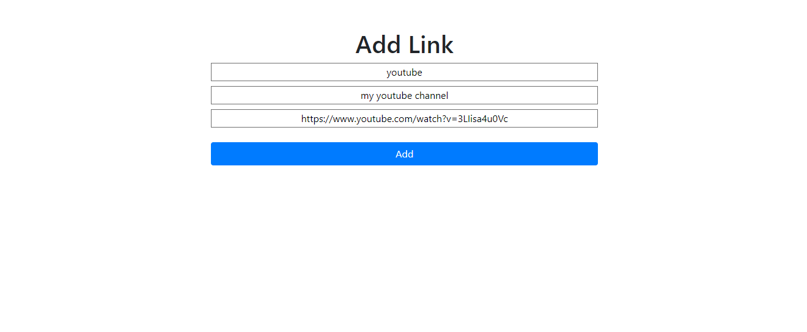
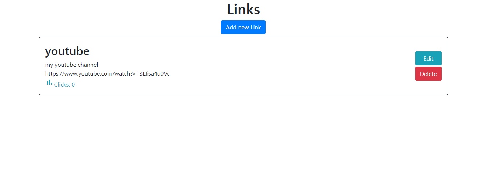
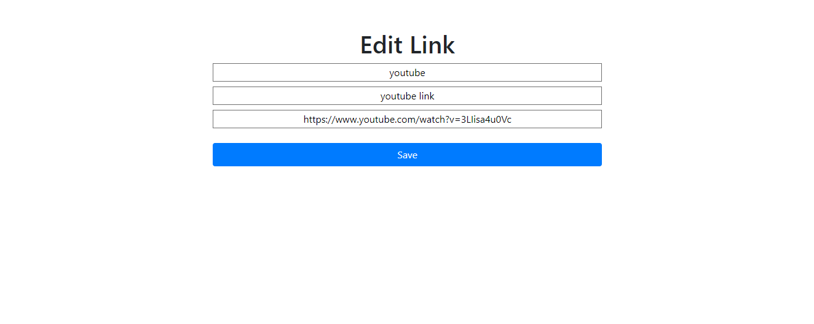
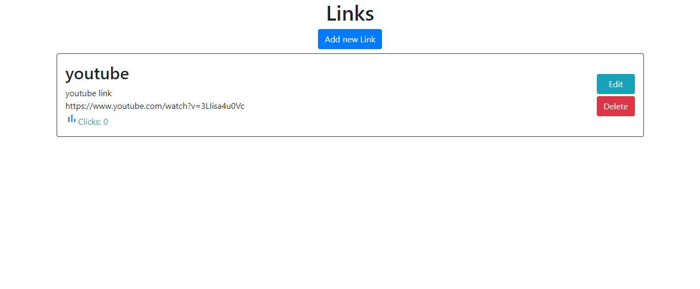

# Link Crud 💾

What this app make:
It's a CRUD here you add a title description and URL , before save on DataBase will check all the fields , if is a real URL after this save.
You can edit all the cards , and to go to your URL pages it's just use the search bar after the app name your link title. Example...
App name (localhost:3000/)
If you have a card with title youtube and wanna go to this link just put...
(localhost:3000/youtube)
After this you will be redirected.

# Dependencies

```bash
  # Clone this repository
  $ git clone https://github.com/AugustoBernardes/link-crud
  
  # Dotenv
  $ npm install dotenv
  
  # Ejs
  $ npm install ejs
  
  # Express
  $ npm install express
  
  # Method-override
  $ npm install method-override
  
  # Mongoose
  $ npm install mongoose
  
  # Serve-favicon
  $ npm install serve-favicon
  
```
#  Observation:
  Is necessery you have NodeJs...
  ```bash
    https://nodejs.org/en/
  ```
  
# About Data Base

How you can see on the files have a file named (.env_sample).
Change the name to (.env) to you application work, after this follow the instruction.
Put you MongoDB url and a put number.
Like this:
```bash
  DB_KEY=mongodb+srv://<user>:<password>@cluster0.mc9wa.mongodb.net/<yourDataBaseName>?retryWrites=true&w=majority
  PORT=3000
```

To start  the app use:
```console
  npm start
```

# Design 🖥️







